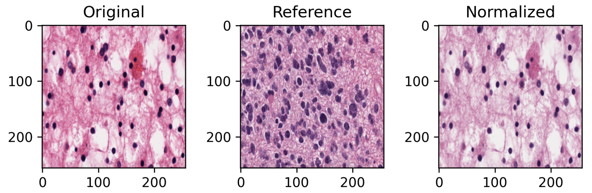

# fast-stain-normalization

[](https://github.com/DAVFoundation/captain-n3m0/blob/master/LICENSE)

This repository contains a tool for stain normalizing images, relevant for computational pathology.

We also include a minor runtime benchmark of some **open-source stain normalization** methods.

The source code is available for both. See [here](https://github.com/andreped/fast-stain-normalization#usage) for how to use the tool on your own data, and see [here](https://github.com/andreped/fast-stain-normalization#running-experiments) for how to redo the benchmark experiments.



## Usage
1. Clone repository:
```
git clone https://github.com/andreped/fast-stain-normalization.git
cd fast-stain-normalization/
```

2. Create virtual environment and install dependencies:
```
virtualenv -ppython3 venv_torch --clear
source venv_torch/bin/activate
pip install -r misc/requirements_torch.txt
pip install torch==1.7.0+cu110 torchvision==0.8.0+cu110 torchaudio==0.7.0 -f https://download.pytorch.org/whl/torch_stable.html
pip install git+https://github.com/andreped/torchstain.git
cd examples/
```

3. Run script using the CLI:
```
python normalizer_torch.py --ref full-path-to-reference-image --img path-to-images-to-convert --out path-to-store-output
```

| command | description |
| ------------- | ------------- |
| `--ref` | the full path to the reference image you wish to use, including filename and format. |
| `--img` | should either be the path to the directly containing the images you wish to normalize, but it could also be the full path to a single image. |
| `--out` | the path to where you wish to store the result. It will be stored in the same structure as provided in `--img`, and default is `./`. |

## Experiment

For the benchmarking we used the libraries: [ITKColorNormalization](https://github.com/InsightSoftwareConsortium/ITKColorNormalization), [StainTools](https://github.com/Peter554/StainTools) and [torchstain](https://github.com/EIDOSlab/torchstain). ITK and TorchStain (TS) included implementations of the Vahadane and Macenko algorithms, respectively, whereas StainTools included implementations of the Vahadane, Macenko, and Reinhard algorithms. Runtime experiments were conducted over 50 iterations using default parameters, and the mean and standard deviation were reported. The hardware used was an eight-core Intel i7-9800X CPU, with 32 GB RAM, using the Ubuntu Linux 18.04 operating system.

Apriori, we know that the Vahadane method is the best performing method among the three. Macenko performs similar to Vahadane, but is less consistent. Reinhard is the oldest methods of the three and less suited for H%E-stained images.

## Result

| Method  | Reinhard | Macenko | Vahadane | Vahadane (ITK) | Macenko (TS) |
| ------------- | ------------- | ------------- | ------------- | ------------- | ------------- |
| Runtime (s)  | 0.00251 +- 0.00007 | 0.61686 +- 0.01654 | 1.45747 +- 0.00810 | 0.04486 +- 0.027056 | 0.00655 +- 0.00152 |

Preliminary results showed that the Reinhard color augmentation algorithm was the fastest, but the second fastest method was the Macenko implementation in TS. The third fastest was ITK's implementation of Vahadane. StainTools' implementations of Vahadane and Macenko fell short compared to its counterparts.

## Discussion

After running ITK's implementation of Vahadane on other images, we found that the method was less robust than TS's implementation of Macenko. ITK seemed to crash often and produce errors on most images that contained either some noise or in scenarios where there were poor contrast between the colours, which might happen when looking at the tissue from a lower resolution level. Hence, the best trade-off among the three might be TS' implementation of Macenko as it is robust, fast, and provides suitable normalization performance [(see here for reference)](https://ieeexplore.ieee.org/stamp/stamp.jsp?arnumber=7460968). 

## Conclusion

Even though StainTools offers more functionality, both in terms of stain normalization and augmentation, it is not nearly as optimized as the two other alternatives, for respective methods. We found that TS' implementation of Macenko to be best suited for our application, and we have implemented a tool for applying this on your own data.

## Running Experiments

1. Clone repository:
```
git clone https://github.com/andreped/fast-stain-normalization.git
cd fast-stain-normalization/
```

2. Create virtual environment and install dependencies:
```
virtualenv -ppython3 venv --clear
source venv/bin/activate
pip install -r misc/requirements.txt
cd examples/
```

3. Run script using the CLI:
```
python runtime.py
```

The script support various arguments, i.e. for choosing which method to use or how many iterations to run. Append **-h** to the command to see which arguments are supported and how to use them.

## Troubleshooting

Virtualenv can be installed using pip:
```
pip install virtualenv
```

To activate virtual environments on Windows (the description above was for Unix systems), you can run the command:
```
./venv/Scripts/activate
```

#### Benchmark-related only:
Note that StainTools depends on [SPAMS](https://github.com/samuelstjean/spams-python), which is currently not supported on Windows. Hence, it would not be possible to run the experiments using the Windows operating system. However, Ubuntu Linux and macOS should work.

If the patch size chosen is too small, the stain normalization methods might fail, especially the ITK-implementation. The same implementation might also fail if a colourless patch is provided. The reference image and input images should therefore be of representative size with meaningful content, for the method to produce a meaningful output.


## Acknowledgements

This could not have been possible without the great effort of fellow open-source GitHub users that provide brilliant solutions for me to test and explore!

The code is based on the three GitHub repositories: [ITKColorNormalization](https://github.com/InsightSoftwareConsortium/ITKColorNormalization), [StainTools](https://github.com/Peter554/StainTools) and [torchstain](https://github.com/EIDOSlab/torchstain). Where the latter, torchstain, was used as foundation to develop the tool.
